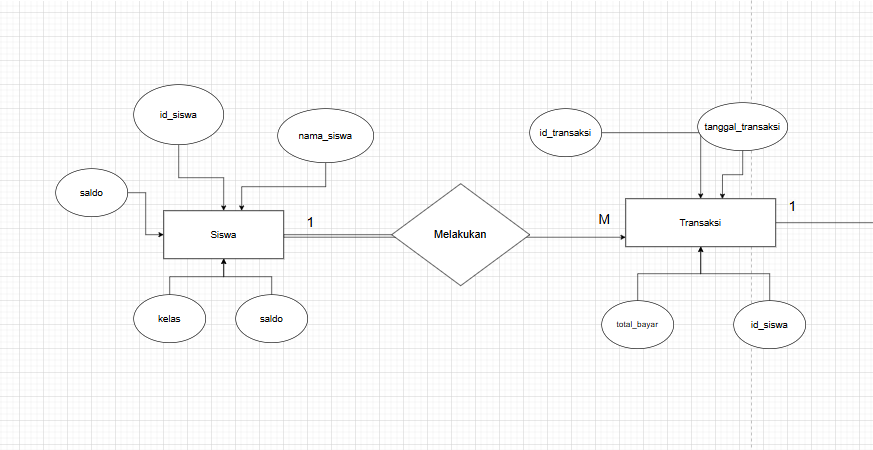
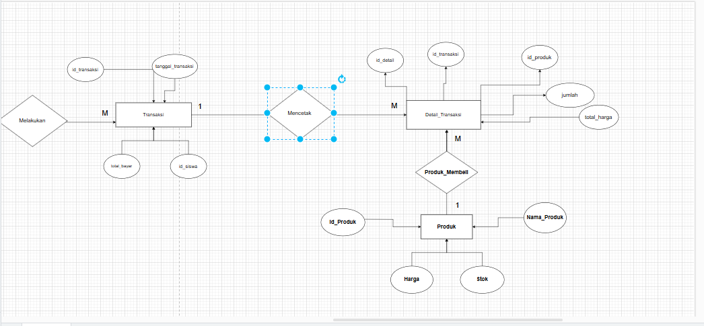

 
### 1. **Relasi "Melakukan" antara Siswa dan Transaksi**

- **Relasi**: "Melakukan" menghubungkan entitas `Siswa` dengan entitas `Transaksi`.
- **Kardinalitas**:
    - **Dari `Siswa` ke `Transaksi` (1
        
        )**:
        - Setiap siswa dapat melakukan **banyak transaksi**. Misalnya, seorang siswa dapat melakukan transaksi lebih dari sekali, seperti ketika membeli buku atau keperluan lainnya secara berkala.
        - Ini digambarkan dengan angka "1" di sisi `Siswa` dan "M" di sisi `Transaksi`.
    - **Dari `Transaksi` ke `Siswa` (M:1)**:
        - Setiap transaksi **hanya dilakukan oleh satu siswa**. Artinya, satu transaksi tidak bisa dilakukan oleh beberapa siswa sekaligus.
        - Ini digambarkan dengan angka "M" di sisi `Siswa` dan "1" di sisi `Transaksi`.

**Kesimpulan**: Hubungan antara `Siswa` dan `Transaksi` adalah **1**

, di mana satu siswa dapat melakukan banyak transaksi, tetapi setiap transaksi hanya dilakukan oleh satu siswa.
### 2. **Relasi "Mencetak" antara Transaksi dan Detail_Transaksi**

- **Relasi**: "Mencetak" menghubungkan entitas `Transaksi` dengan entitas `Detail_Transaksi`.

- **Kardinalitas**:
    - **Dari `Transaksi` ke `Detail_Transaksi` (1
        
        )**:
        - Setiap transaksi dapat memiliki **banyak detail transaksi**. Misalnya, dalam satu transaksi, seorang siswa dapat membeli lebih dari satu produk (beberapa item dalam satu transaksi), sehingga satu transaksi memiliki banyak detail transaksi.
        - Ini digambarkan dengan angka "1" di sisi `Transaksi` dan "M" di sisi `Detail_Transaksi`.
    - **Dari `Detail_Transaksi` ke `Transaksi` (M:1)**:
        - Setiap detail transaksi **hanya terkait dengan satu transaksi**. Artinya, satu detail transaksi hanya merupakan bagian dari satu transaksi, bukan dari beberapa transaksi.
        - Ini digambarkan dengan angka "M" di sisi `Detail_Transaksi` dan "1" di sisi `Transaksi`.

**Kesimpulan**: Hubungan antara `Transaksi` dan `Detail_Transaksi` adalah **1**

, di mana satu transaksi dapat memiliki banyak detail transaksi, tetapi setiap detail transaksi hanya terkait dengan satu transaksi.

### 3. **Relasi "Produk_Membeli" antara Detail_Transaksi dan Produk**

- **Relasi**: "Produk_Membeli" menghubungkan entitas `Detail_Transaksi` dengan entitas `Produk`.
- **Kardinalitas**:
    - **Dari `Detail_Transaksi` ke `Produk` (M:1)**:
        - Banyak detail transaksi dapat merujuk pada **satu produk yang sama**. Misalnya, beberapa siswa mungkin membeli produk yang sama dalam transaksi yang berbeda, sehingga ada beberapa detail transaksi yang terkait dengan produk yang sama.
        - Ini digambarkan dengan angka "M" di sisi `Detail_Transaksi` dan "1" di sisi `Produk`.
    - **Dari `Produk` ke `Detail_Transaksi` (1
        
        )**:
        - Setiap produk dapat muncul dalam **banyak detail transaksi**. Misalnya, jika produk "Buku A" dibeli oleh beberapa siswa pada waktu yang berbeda, maka "Buku A" akan muncul dalam banyak detail transaksi.
        - Ini digambarkan dengan angka "1" di sisi `Produk` dan "M" di sisi `Detail_Transaksi`.

**Kesimpulan**: Hubungan antara `Detail_Transaksi` dan `Produk` adalah **M:1**, di mana banyak detail transaksi dapat merujuk pada satu produk, tetapi satu produk dapat muncul dalam beberapa detail transaksi.
### Ringkasan Keseluruhan Kardinalitas
- **Siswa dan Transaksi**: 1

    - Satu siswa bisa melakukan banyak transaksi, tetapi satu transaksi hanya dilakukan oleh satu siswa.
- **Transaksi dan Detail_Transaksi**: 1

    - Satu transaksi bisa mencakup banyak detail transaksi, tetapi satu detail transaksi hanya terkait dengan satu transaksi.
- **Detail_Transaksi dan Produk**: M:1
    - Banyak detail transaksi dapat merujuk pada satu produk, tetapi satu produk dapat muncul dalam banyak detail transaksi.
Diagram ini menjelaskan hubungan antara siswa, transaksi yang mereka lakukan, detail dari setiap transaksi, dan produk yang dibeli dalam transaksi tersebut.

