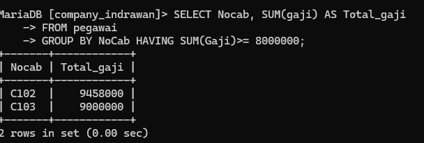

## 1. membuat database company_indrawan.
*STRUKTUR "*
SQL
```sql
CREATE TABLE pegawai (
-> NIP INT PRIMARY KEY,
-> NDep VARCHAR(255) NOT NULL,
-> NBlk VARCHAR(255),
-> JK ENUM('L', 'P') NOT NULL,
-> Alamat TEXT NOT NULL,
-> Telp VARCHAR(255) NOT NULL,
Jabatan ENUM('Manager', 'Sales', 'Staff'),
    Gaji BIGINT NOT NULL,
    NoCab VARCHAR(255) NOT NULL
);
```


*PENJELASAN :*
1. **NIP (Nomor Induk Pegawai)**:
    - Tipe data INT dipilih karena NIP biasanya berupa angka yang dapat direpresentasikan dengan tipe data integer.
    - PRIMARY KEY menunjukkan bahwa kolom NIP adalah kunci utama (primary key) yang unik untuk setiap data pegawai.
2. **NDep (Nama Departemen)** dan **NBlk (Nama Belakang)**:
    
    - Tipe data VARCHAR(255)dipilih karena nama departemen dan nama belakang dapat berupa string yang panjangnya bervariasi, namun tidak melebihi 255 karakter.
    - NOT NULL menunjukkan bahwa kolom NDep dan NBlk harus diisi, karena informasi tersebut dianggap penting untuk data pegawai.
3. **JK (Jenis Kelamin)**:
    
    - Tipe data ENUM('L', 'P') dipilih karena jenis kelamin hanya memiliki dua kemungkinan, yaitu 'Laki-laki' dan 'Perempuan'.
    - NOT NULL menunjukkan bahwa kolom JK harus diisi, karena informasi jenis kelamin dianggap penting untuk data pegawai.
4. **Alamat**:
    - Tipe data TEXT dipilih karena alamat dapat berisi string yang lebih panjang daripada VARCHAR(255)
    - NOT NULL menunjukkan bahwa kolom Alamat harus diisi, karena informasi tersebut dianggap penting untuk data pegawai.
5. **Telp (Telepon)**:
    
    - Tipe data VARCHAR(255) dipilih karena nomor telepon dapat berupa string yang panjangnya bervariasi, namun tidak melebihi 255 karakter.
    - NOT NULL menunjukkan bahwa kolom Telp harus diisi, karena informasi kontak pegawai dianggap penting.
6. **Jabatan**:
    
    - Tipe data ENUM('Manager', 'sales', 'Staff') dipilih karena jabatan pegawai hanya memiliki tiga kemungkinan.
    - Tidak ada atribut NOT NULL atau NULL, artinya kolom Jabatan boleh diisi atau dibiarkan kosong.
7. **Gaji**:
    
    - Tipe data BIGINT dipilih karena gaji pegawai dapat berupa angka yang cukup besar.
    - NOT NULL menunjukkan bahwa kolom Gaji harus diisi, karena informasi gaji dianggap penting untuk data pegawai.
8. **NoCab (Nomor Cabang)**:
    
    - Tipe data VARCHAR(255) dipilih karena nomor cabang dapat berupa string yang panjangnya bervariasi, namun tidak melebihi 255 karakter.
    - NOT NULL menunjukkan bahwa kolom NoCab harus diisi, karena informasi cabang dianggap penting untuk data pegawai.

Secara umum, penggunaan tipe data dan atribut NOT NULL atau NULL pada tabel pegawai ini dimaksudkan untuk menjaga integritas dan konsistensi data, serta memastikan bahwa informasi yang dianggap penting untuk data pegawai selalu tersedia.

*HASIL :*


## 2. membuat table pegawai  .
*STRUKTUR "*
SQL
```sql
INSERT INTO pegawai (NIP, NDep, NBlk, JK, Alamat, Telp, Jabatan, Gaji, NoCab) VALUES 
-> (10107, 'Emya', 'Salsalina', 'P', 'JL. Suci 78 Bandung', '022-555768', 'Manager', 5250000, 'C101'), 
-> (10246, 'Dian', 'Anggraini', 'P', 'JL. Mawar 5 Semarang', '024-555102', 'Supervisor', 2750000, 'C103'), 
-> (10324, 'Martin', 'Susanto', 'L', 'JL. Bima 51 Jakarta', '021-555785', 'Staff', 1750000, 'C102'), 
-> (10252, 'Antoni', 'Irawan', 'L', 'JL. A. Yani 15 Jakarta', '021-555888', 'Manager', 5750000, 'C102'), 
-> (10176, 'Diah', 'Wahyuni', 'P', 'JL. Maluku 56 Bandung', '022-555934', 'Supervisor', 2500000, 'C101'), 
-> (10314, 'Ayu', 'Rahmadani', 'P', 'JL. Malaka 342 Jakarta', '021-555098', 'Supervisor', 1950000, 'C102'), 
-> (10307, 'Erik', 'Adrian', 'L', 'JL. Manggis 5 Semarang', '024-555236', 'Manager', 6250000, 'C103'), 
-> (10415, 'Susan', 'Sumantri', 'P', 'JL. Pahlawan 24 Surabaya', '031-555120', '', 2650000, 'C104'), 
-> (10407, 'Rio', 'Gunawan', 'L', 'JL. Melati 356 Surabaya', '031-555231', 'Staff', 1725000, 'C104');
```


*PENJELASAN :*
- *INSERT INTO pegawai*:
    - Menunjukkan bahwa Anda akan menambahkan data ke tabel bernama pegawai.
    
- *(NIP, NDep, NBlk, JK, Alamat, Telp, Jabatan, Gaji, NoCab)*:
    - Ini adalah daftar kolom dalam tabel pegawai yang akan diisi dengan data. Kolom-kolom ini adalah:
        - NIP (Nomor Induk Pegawai)
        - NDep (Nama Depan)
        - NBlk (Nama Belakang)
        - JK (Jenis Kelamin)
    - Alamat (Alamat)
        - Telp (Telepon)
        - Jabatan (Jabatan)
        - Gaji (Gaji)
        - NoCab (Nomor Cabang)
   
- *VALUES*:
    - Menunjukkan data yang akan dimasukkan ke dalam tabel. Data untuk setiap baris harus sesuai dengan urutan kolom yang disebutkan sebelumnya.
    
- *Data yang Dimasukkan*:
    - Baris pertama:
        - NIP: 10107
        - NDep: 'Emya'
        - NBlk: 'Salsalina'
        - JK: 'P' (Perempuan)
        - Alamat: 'JL. Suci 78 Bandung'
        - Telp: '022-555768'
        - Jabatan: 'Manager'
        - Gaji: 5250000
        - NoCab: 'C101'
    - Baris kedua dan seterusnya mengikuti pola yang sama, dengan data yang berbeda.
    
- *Catatan*:
    - Pada baris 10415 untuk Susan Sumantri, kolom Jabatan tidak diisi (''), yang bisa menyebabkan masalah jika kolom Jabatan adalah ENUM dan tidak termasuk nilai kosong. Pastikan kolom Jabatan memiliki nilai yang valid.
    - Jika ada nilai kosong ('') dalam kolom Jabatan, Anda mungkin ingin memperbarui baris ini dengan jabatan yang sesuai, seperti 'Staff', atau menyesuaikan schema tabel untuk mengizinkan nilai kosong jika perlu.

*HASIL :*


# select table

## jumlahpegawai and jumlahjabatan

### SINTAKS
```sql 
select  COUNT(NIP) AS Jumlahpegawai, COUNT(Jabatan) AS JumlahJabatan FROM pegawai;
```

### PENJELASAN 
1. **SELECT**: Ini adalah kata kunci SQL yang digunakan untuk memulai pernyataan SQL untuk mengambil data dari tabel.
2. **COUNT(NIP) AS Jumlahpegawai**:
    - COUNT(NIP) adalah fungsi agregat SQL yang menghitung jumlah baris dalam kolom "NIP" (Nomor Induk Pegawai). Fungsi COUNT menghitung jumlah baris yang memiliki nilai non-NULL dalam kolom yang diberikan.
    - AS Jumlahpegawai adalah penggunaan alias (alias) untuk memberikan nama kolom yang lebih mudah dipahami, yaitu "Jumlahpegawai".
3. **COUNT(Jabatan) AS JumlahJabatan**:
    - COUNT(Jabatan) adalah fungsi agregat SQL yang menghitung jumlah baris dalam kolom "Jabatan". Fungsi COUNT menghitung jumlah baris yang memiliki nilai non-NULL dalam kolom yang diberikan.
    - AS JumlahJabatan adalah penggunaan alias (alias) untuk memberikan nama kolom yang lebih mudah dipahami, yaitu "JumlahJabatan".
4. **FROM pegawai**: Ini adalah klausa SQL yang menentukan tabel dari mana data akan diambil, yaitu tabel "pegawai".
Jadi, pernyataan SQL tersebut akan menghasilkan dua kolom:
wai" yang berisi jumlah baris (jumlah pegawai) dalam tabel "pegawai".
2. "JumlahJabatan" yang berisi jumlah baris (jumlah jabatan) dalam tabel "pegawai".

### HASIL : 


## jumlah pegawai

### sintaks
```SQL
 SELECT COUNT(NIP) AS Jumlahpegawai
    -> FROM pegawai
    -> where NoCab ='C102';
```

### PENJELASAN
1. **SELECT COUNT(NIP) AS Jumlahpegawai**:
    - SELECT: Ini adalah kata kunci SQL yang digunakan untuk memulai pernyataan SQL untuk mengambil data dari tabel.
    - COUNT(NIP): Ini adalah fungsi agregat SQL yang menghitung jumlah baris dalam kolom "NIP" (Nomor Induk Pegawai). Fungsi COUNT menghitung jumlah baris yang memiliki nilai non-NULL dalam kolom yang diberikan.
    - AS Jumlahpegawai: Ini adalah penggunaan alias (alias) untuk memberikan nama kolom yang lebih mudah dipahami, yaitu "Jumlahpegawai".
2. **FROM pegawai**:
    - FROM: Ini adalah klausa SQL yang menentukan tabel dari mana data akan diambil, yaitu tabel "pegawai".
3. **WHERE NoCab ='C102'**:
    - WHERE: Ini adalah klausa SQL yang digunakan untuk memfilter baris berdasarkan kondisi tertentu.
    - NoCab =C102: Ini adalah kondisi yang akan digunakan untuk memfilter baris di mana nilai kolom "NoCab" (Nomor Cabang) sama dengan 'C102'.
Jadi, pernyataan SQL tersebut akan menghasilkan satu kolom:
- "Jumlahpegawai" yang berisi jumlah baris (jumlah pegawai) dalam tabel "pegawai" di mana nilai "NoCab" (Nomor Cabang) sama dengan 'C102'.


### HASIL:


## NoCab jumlahpegawai

### sintaks
```sql
SELECT NoCab,COUNT(NIP) AS Jumlahpegawai
    -> FROM  Pegawai
    -> GROUP BY NoCab;
```
### PENJELASAN
1. SELECT NoCab, COUNT(NIP) AS Jumlahpegawai:
    - SELECT: Ini adalah kata kunci SQL yang digunakan untuk memulai pernyataan SQL untuk mengambil data dari tabel.
    - NoCab: Ini adalah nama kolom yang akan diambil dari tabel. Kolom ini mungkin berisi nomor cabang.
    - COUNT(NIP): Ini adalah fungsi agregat SQL yang menghitung jumlah baris dalam kolom "NIP" (Nomor Induk Pegawai). Fungsi COUNT menghitung jumlah baris yang memiliki nilai non-NULL dalam kolom yang diberikan.
    - AS Jumlahpegawai: Ini adalah penggunaan alias (alias) untuk memberikan nama kolom yang lebih mudah dipahami, yaitu "Jumlahpegawai".
2. FROM Pegawai:
    - FROM: Ini adalah klausa SQL yang menentukan tabel dari mana data akan diambil, yaitu tabel "Pegawai".
3. GROUP BY NoCab:
    - GROUP BY: Ini adalah klausa SQL yang digunakan untuk mengelompokkan baris berdasarkan satu atau lebih kolom.
    - NoCab: Ini adalah kolom yang akan digunakan untuk mengelompokkan baris. Dalam hal ini, baris akan dikelompokkan berdasarkan nilai kolom "NoCab" (Nomor Cabang).
Jadi, pernyataan SQL tersebut akan menghasilkan dua kolom:
- "NoCab" yang berisi nomor cabang
- "Jumlahpegawai" yang berisi jumlah pegawai untuk setiap nomor cabang

### HASIL:


## NoCab jumlah pegawai having
### sintaks
```sql
Select Nocab, Count(NIP) AS Jumlahpegawai
    -> FROM pegawai
    -> GROUP BY NoCab HAVING COUNT(NIP)>= 3;
```
### PENJELASAN
1. SELECT NoCab, COUNT(NIP) AS Jumlahpegawai:
    - SELECT: Ini adalah kata kunci SQL yang digunakan untuk memulai pernyataan SQL untuk mengambil data dari tabel.
    - NoCab: Ini adalah nama kolom yang akan diambil dari tabel. Kolom ini mungkin berisi nomor cabang.
    - COUNT(NIP): Ini adalah fungsi agregat SQL yang menghitung jumlah baris dalam kolom "NIP" (Nomor Induk Pegawai). Fungsi COUNT menghitung jumlah baris yang memiliki nilai non-NULL dalam kolom yang diberikan.
    - AS Jumlahpegawai: Ini adalah penggunaan alias (alias) untuk memberikan nama kolom yang lebih mudah dipahami, yaitu "Jumlahpegawai".
2. FROM pegawai:
    - FROM: Ini adalah klausa SQL yang menentukan tabel dari mana data akan diambil, yaitu tabel "pegawai".
3. GROUP BY NoCab:
    - GROUP BY: Ini adalah klausa SQL yang digunakan untuk mengelompokkan baris berdasarkan satu atau lebih kolom.
    - NoCab: Ini adalah kolom yang akan digunakan untuk mengelompokkan baris. Dalam hal ini, baris akan dikelompokkan berdasarkan nilai kolom "NoCab" (Nomor Cabang).
4. HAVING COUNT(NIP) >= 3:
    - HAVING: Ini adalah klausa SQL yang digunakan untuk memfilter kelompok berdasarkan kondisi tertentu, setelah pengelompokan dilakukan.
    - COUNT(NIP) >= 3: Ini adalah kondisi yang akan digunakan untuk memfilter kelompok di mana jumlah baris (jumlah pegawai) dalam setiap grup (cabang) lebih besar atau sama dengan 3.
Jadi, pernyataan SQL tersebut akan menghasilkan dua kolom:
- "NoCab" yang berisi nomor cabang
- "Jumlahpegawai" yang berisi jumlah pegawai untuk setiap nomor cabang yang memiliki jumlah pegawai lebih besar atau sama dengan 3.
### HASIL:


## total_gaji
### sintaks
```sql
SELECT SUM(Gaji) AS Total_GAJI
    -> FROM pegawai;
```
### PENJELASAN
1. SELECT:
    - Ini adalah kata kunci SQL yang digunakan untuk memulai pernyataan SQL untuk mengambil data dari tabel.
2. SUM(Gaji):
    - SUM: Ini adalah fungsi agregat SQL yang menghitung jumlah total dari nilai-nilai dalam kolom yang diberikan.
    - Gaji: Ini adalah nama kolom yang akan dijumlahkan, yaitu kolom "Gaji".
3. AS:
    - Ini adalah kata kunci SQL yang digunakan untuk memberikan alias (nama baru) pada kolom hasil.
4. Total_GAJI:
    - Ini adalah alias (nama baru) yang diberikan pada kolom yang berisi jumlah total gaji.
5. FROM:
    - Ini adalah kata kunci SQL yang menentukan tabel dari mana data akan diambil.
6. pegawai:
    - Ini adalah nama tabel dari mana data akan diambil.
Jadi, keseluruhan pernyataan SQL tersebut akan mengambil data dari tabel "pegawai", menghitung jumlah total gaji dari semua pegawai, dan menampilkannya dengan nama kolom "Total_GAJI".

### HASIL:


## gaji manager
### sintaks
```sql
SELECT SUM(Gaji) AS Gaji_Manager
    -> FROM pegawai
    -> WHERE Jabatan = 'Manager';
```
### PENJELASAN
1. SELECT SUM(Gaji) AS Gaji_Manager:
    - SELECT: Ini adalah kata kunci SQL yang digunakan untuk memulai pernyataan SQL untuk mengambil data dari tabel.
    - SUM(Gaji): Ini adalah fungsi agregat SQL yang menghitung jumlah total dari nilai-nilai dalam kolom "Gaji".
    - AS Gaji_Manager: Ini adalah penggunaan alias (nama baru) untuk memberikan nama kolom yang lebih mudah dipahami, yaitu "Gaji_Manager".
2. FROM pegawai:
    - FROM: Ini adalah klausa SQL yang menentukan tabel dari mana data akan diambil, yaitu tabel "pegawai".
3. WHERE Jabatan = 'Manager':
    - WHERE: Ini adalah klausa SQL yang digunakan untuk memfilter data berdasarkan kondisi tertentu.
    - Jabatan = 'Manager': Ini adalah kondisi filter yang akan memilih hanya data di mana nilai kolom "Jabatan" adalah 'Manager'.
Jadi, pernyataan SQL tersebut akan:
1. Mengambil data dari tabel "pegawai".
2. Menghitung jumlah total gaji dari semua pegawai yang memiliki jabatan "Manager".
3. Menampilkan hasil jumlah total gaji dengan nama kolom "Gaji_Manager".
### HASIL:


## NoCab Total_gaji
### sintaks
```sql
SELECT NoCab, SUM(Gaji) AS Total_Gaji
    -> FROM pegawai
    -> GROUP BY NoCab;
```
### PENJELASAN 
1. SELECT NoCab, SUM(Gaji) AS Total_Gaji
    - SELECT: Ini adalah kata kunci untuk menentukan kolom-kolom yang ingin ditampilkan dalam hasil query.
    - NoCab: Kolom yang berisi nomor cabang tempat seorang pegawai bekerja.
    - SUM(Gaji): Fungsi agregat yang akan menjumlahkan seluruh nilai pada kolom Gaji.
    - AS Total_Gaji: Memberikan alias atau nama baru untuk hasil penjumlahan gaji, yaitu "Total_Gaji".
2. FROM pegawai
    - FROM: Kata kunci yang menentukan tabel tempat data berasal.
    - pegawai: Nama tabel yang berisi data-data pegawai.
3. GROUP BY NoCab
    - GROUP BY: Kata kunci yang akan mengelompokkan baris-baris data berdasarkan nilai pada kolom NoCab.
    - Jadi, query ini akan menghitung total gaji untuk setiap nomor cabang yang ada pada tabel pegawai.
Secara keseluruhan, query ini akan menghasilkan sebuah tabel dengan dua kolom:
1. NoCab: Menampilkan nomor cabang
2. Total_Gaji: Mena
### HASIL:

## Total gaji nocab having SUM
### sintaks
```sql
SELECT Nocab, SUM(gaji) AS Total_gaji
    -> FROM pegawai
    -> GROUP BY NoCab HAVING SUM(Gaji)>= 8000000;
```
### PENJELASAN
1. SELECT NoCab, SUM(Gaji) AS Total_Gaji
    - SELECT: Menentukan kolom-kolom yang akan ditampilkan dalam hasil query.
    - NoCab: Kolom yang berisi nomor cabang tempat pegawai bekerja.
    - SUM(Gaji): Fungsi agregat yang akan menjumlahkan seluruh nilai pada kolom Gaji.
    - AS Total_Gaji: Memberikan alias "Total_Gaji" untuk hasil penjumlahan gaji.
2. FROM pegawai
    - FROM: Menentukan tabel sumber data, yaitu tabel "pegawai".
3. GROUP BY NoCab
    - GROUP BY: Mengelompokkan baris-baris data berdasarkan nilai pada kolom NoCab.
4. HAVING SUM(Gaji) >= 8000000

    - HAVING: Menambahkan kondisi filter pada hasil pengelompokkan.
    - SUM(Gaji) >= 8000000: Hanya menampilkan kelompok-kelompok (cabang) yang memiliki total gaji lebih besar atau sama dengan 8.000.000.
Jadi, query ini akan menghasilkan tabel yang berisi:
1. NoCab: Nomor cabang
2. Total_Gaji: Total gaji untuk
### HASIL:


## select AVG(gaji)
 ### sintaks
```sql
select AVG(gaji) AS Rata_rata -> FROM pegawai;
```
### PENJELASAN
1. SELECT AVG(Gaji) AS Rata_rata
    
    - SELECT: Menentukan kolom yang akan ditampilkan dalam hasil query.
    - AVG(Gaji): Fungsi agregat yang akan menghitung rata-rata (average) dari nilai-nilai pada kolom Gaji.
    - AS Rata_rata: Memberikan alias "Rata_rata" untuk hasil perhitungan rata-rata gaji.
2. FROM pegawai
    
    - FROM: Menentukan tabel sumber data, yaitu tabel "pegawai".

Jadi, query ini akan menghasilkan sebuah tabel dengan satu baris dan satu kolom, yang berisi nilai rata-rata gaji dari seluruh pegawai yang terdapat dalam tabel "pegawai".
### HASIL:


## select gaji maneger

### sintaks
```sql
SELECT AVG(gaji) AS GajiRataMgr
    -> FROM pegawai
    -> WHERE Jabatan = 'Manager';
```
### PENJELASAN
1. SELECT AVG(Gaji) AS GajiRataMgr
    - SELECT: Menentukan kolom yang akan ditampilkan dalam hasil query.
    - AVG(Gaji): Fungsi agregat yang akan menghitung rata-rata (average) dari nilai-nilai pada kolom Gaji.
    - AS GajiRataMgr: Memberikan alias "GajiRataMgr" untuk hasil perhitungan rata-rata gaji.
2. FROM pegawai
    - FROM: Menentukan tabel sumber data, yaitu tabel "pegawai".
3. WHERE Jabatan = 'Manager'
    - WHERE: Menambahkan kondisi filter pada baris-baris data.
    - Jabatan = 'Manager': Hanya akan memilih baris-baris data di mana nilai pada kolom Jabatan adalah 'Manager'.
Jadi, query ini akan menghasilkan sebuah tabel dengan satu baris dan satu kolom, yang berisi nilai rata-rata gaji dari seluruh pegawai yang memiliki jabatan sebagai Manager.
### HASIL:


## avg ratagaji

### sintaks
```sql
SELECT NoCab,AVG(Gaji) AS Ratagaji
    -> FROM pegawai
    -> GROUP BY NoCab;
```
### PENJELASAN
1. SELECT NoCab, AVG(Gaji) AS RataGaji
    - SELECT: Menentukan kolom-kolom yang akan ditampilkan dalam hasil query.
    - NoCab: Kolom yang berisi nomor cabang tempat pegawai bekerja.
    - AVG(Gaji): Fungsi agregat yang akan menghitung rata-rata (average) dari nilai-nilai pada kolom Gaji.
    - AS RataGaji: Memberikan alias "RataGaji" untuk hasil perhitungan rata-rata gaji.
2. FROM pegawai
    - FROM: Menentukan tabel sumber data, yaitu tabel "pegawai".
3. GROUP BY NoCab
    - GROUP BY: Mengelompokkan baris-baris data berdasarkan nilai pada kolom NoCab.
Jadi, query ini akan menghasilkan sebuah tabel dengan dua kolom:
1. NoCab: Nomor cabang
2. RataGaji: Rata-rata gaji untuk masing-masing cabang
### HASIL:


## avg ratagaji no cab-no cab
### sintaks
```sql
SELECT Nocab, AVG(gaji) AS Ratagaji
    -> FROM pegawai
    -> GROUP BY NoCab HAVING NoCab ='C101' OR NoCAB = 'C102';
```
### PENJELASAN
1. SELECT NoCab, AVG(Gaji) AS RataGaji
    - SELECT: Menentukan kolom-kolom yang akan ditampilkan dalam hasil query.
    - NoCab: Kolom yang berisi nomor cabang tempat pegawai bekerja.
    - AVG(Gaji): Fungsi agregat yang akan menghitung rata-rata (average) dari nilai-nilai pada kolom Gaji.
    - AS RataGaji: Memberikan alias "RataGaji" untuk hasil perhitungan rata-rata gaji.
2. FROM pegawai
    - FROM: Menentukan tabel sumber data, yaitu tabel "pegawai".
3. GROUP BY NoCab
    - GROUP BY: Mengelompokkan baris-baris data berdasarkan nilai pada kolom NoCab.
4. HAVING NoCab = 'C101' OR NoCab = 'C102'
    - HAVING: Menambahkan kondisi filter pada hasil pengelompokkan.
    - NoCab = 'C101' OR NoCab = 'C102': Hanya akan menampilkan kelompok-kelompok (cabang) yang memiliki nomor cabang 'C101' atau 'C102'.
Jadi, query ini akan menghasilkan sebuah tabel dengan dua kolom:
1. NoCab: Nomor cabang (hanya 'C101' dan 'C102')
2. RataGaji: Rata-rata gaj
### HASIL:


## SELECT MAX  Gajiterkecil AS GajiTerbesar
### sintaks
```sql
SELECT MAX(Gaji) AS GajiTerbesar, MIN(Gaji) AS GajiTerkecil
    -> FROM pegawai;
```
### PENJELASAN
mari saya jelaskan query SQL ini:
1. SELECT MAX(Gaji) AS GajiTerbesar, MIN(Gaji) AS GajiTerkecil
    - SELECT: Menentukan kolom-kolom yang akan ditampilkan dalam hasil query.
    - MAX(Gaji): Fungsi agregat yang akan menghitung nilai gaji terbesar.
    - MIN(Gaji): Fungsi agregat yang akan menghitung nilai gaji terkecil.
    - AS GajiTerbesar: Memberikan alias "GajiTerbesar" untuk hasil perhitungan nilai gaji terbesar.
    - AS GajiTerkecil: Memberikan alias "GajiTerkecil" untuk hasil perhitungan nilai gaji terkecil.
2. FROM pegawai
    - FROM: Menentukan tabel sumber data, yaitu tabel "pegawai".
Jadi, query ini akan menghasilkan sebuah tabel dengan dua baris dan dua kolom:
1. Baris pertama: Nilai gaji terbesar di antara semua pegawai.
2. Baris kedua: Nilai gaji terkecil di antara semua pegawai.
### HASIL:


##  SELECT  MAX Gajiterkecil AS GajiTerbesar manager
### sintaks
```sql
SELECT MAX(Gaji) AS GajiTerbesar, MIN(Gaji) AS GajiTerkecil
    -> FROM pegawai
    -> WHERE Jabatan = 'Manager';
```
### PENJELASAN
1. SELECT MAX(Gaji) AS GajiTerbesar, MIN(Gaji) AS GajiTerkecil
    - SELECT: Menentukan kolom-kolom yang akan ditampilkan dalam hasil query.
    - MAX(Gaji): Fungsi agregat yang akan menghitung nilai gaji terbesar.
    - MIN(Gaji): Fungsi agregat yang akan menghitung nilai gaji terkecil.
    - AS GajiTerbesar: Memberikan alias "GajiTerbesar" untuk hasil perhitungan nilai gaji terbesar.
    - AS GajiTerkecil: Memberikan alias "GajiTerkecil" untuk hasil perhitungan nilai gaji terkecil.
2. FROM pegawai
    - FROM: Menentukan tabel sumber data, yaitu tabel "pegawai".
3. WHERE Jabatan = 'Manager'
    - WHERE: Menambahkan kondisi filter pada baris-baris data.
    - Jabatan = 'Manager': Hanya akan memilih baris-baris data di mana nilai pada kolom Jabatan adalah 'Manager'.
Jadi, query ini akan menghasilkan sebuah tabel dengan dua baris dan dua kolom:
1. Baris pertama: Nilai gaji terbesar di antara seluruh pegawai yang memiliki jabatan sebagai Manager.
2. Baris kedua: Nilai gaji terkecil di antara seluruh pegawai yang memiliki jabatan sebagai Manager.
### HASIL:


##  SELECT NoCAB, MAX(Gaji) AS GajiTerbesar, MIN(Gaji)
### sintaks
```sql
 SELECT NoCAB, MAX(Gaji) AS GajiTerbesar, MIN(Gaji) AS GajiTerkecil
    -> FROM pegawai
    -> GROUP BY NoCab;
```
### PENJELASAN
1. SELECT NoCab, MAX(Gaji) AS GajiTerbesar, MIN(Gaji) AS GajiTerkecil:
    - SELECT berfungsi untuk menentukan kolom-kolom yang akan ditampilkan dalam hasil query.
    - NoCab adalah kolom yang berisi nomor cabang tempat pegawai bekerja.
    - MAX(Gaji) adalah fungsi agregat yang akan menghitung nilai gaji terbesar untuk masing-masing cabang.
    - MIN(Gaji) adalah fungsi agregat yang akan menghitung nilai gaji terkecil untuk masing-masing cabang.
    - AS GajiTerbesar dan AS GajiTerkecil memberikan alias untuk hasil perhitungan nilai gaji terbesar dan terkecil.
2. FROM pegawai:
    - FROM menentukan tabel sumber data, yaitu tabel "pegawai".
3. GROUP BY NoCab:
    - GROUP BY mengelompokkan baris-baris data berdasarkan nilai pada kolom NoCab.
Dengan query ini, hasilnya akan berupa tabel yang berisi:
1. Kolom NoCab: Nomor cabang tempat pegawai bekerja.
2. Kolom GajiTerbesar: Nilai gaji terbesar untuk masing-masing cabang.
3. Kolom GajiTerkecil: Nilai gaji terkecil untuk masing-masing cabang.
### HASIL:

## SELECT NoCAB, MAX(Gaji) AS GajiTerbesar, MIN(Gaji) (3)
### sintaks
```sql
 SELECT NoCAB, MAX(Gaji) AS GajiTerbesar, MIN(Gaji) AS GajiTerkecil
    -> FROM pegawai
    -> GROUP BY NoCab;
```
### PENJELASAN
1. SELECT NoCab, MAX(Gaji) AS GajiTerbesar, MIN(Gaji) AS GajiTerkecil
    - SELECT: Menentukan kolom-kolom yang akan ditampilkan dalam hasil query.
    - NoCab: Kolom yang berisi nomor cabang tempat pegawai bekerja.
    - MAX(Gaji): Fungsi agregat yang akan menghitung nilai gaji terbesar untuk masing-masing cabang.
    - MIN(Gaji): Fungsi agregat yang akan menghitung nilai gaji terkecil untuk masing-masing cabang.
    - AS GajiTerbesar: Memberikan alias "GajiTerbesar" untuk hasil perhitungan nilai gaji terbesar.
    - AS GajiTerkecil: Memberikan alias "GajiTerkecil" untuk hasil perhitungan nilai gaji terkecil.
2. FROM pegawai
    - FROM: Menentukan tabel sumber data, yaitu tabel "pegawai".
3. GROUP BY NoCab
    - GROUP BY: Mengelompokkan baris-baris data berdasarkan nilai pada kolom NoCab.
Jadi, query ini akan menghasilkan sebuah tabel dengan tiga kolom:
1. NoCab: Nomor cabang tempat pegawai bekerja.
2. GajiTerbesar: Nilai gaji terbesar untuk masing-masing cabang.
3. GajiTerkecil: Nilai gaji terkecil untuk masing-masing cabang
### HASIL:


## SELECT COUNT(NIP) AS Jumlahpegawai, SUM(Gaji) AS Totalgaji

### sintaks
```sql
 SELECT COUNT(NIP) AS Jumlahpegawai, SUM(Gaji) AS Totalgaji,
    -> AVG(Gaji) AS RataGaji, MAX(Gaji) AS GajiMaks, Min(gaji) AS Gajmin
    -> FROM pegawai;
```
### PENJELASAN
1. SELECT COUNT(NIP) AS Jumlahpegawai:
    - Fungsi COUNT(NIP) menghitung jumlah baris/record pada tabel "pegawai".
    - Hasil hitungan ini diberikan alias "Jumlahpegawai".
2. SUM(Gaji) AS Totalgaji:
    - Fungsi SUM(Gaji) menjumlahkan seluruh nilai gaji pada tabel "pegawai".
    - Hasil penjumlahan ini diberikan alias "Totalgaji".
3. AVG(Gaji) AS RataGaji:
    - Fungsi AVG(Gaji) menghitung rata-rata nilai gaji pada tabel "pegawai".
    - Hasil perhitungan rata-rata ini diberikan alias "RataGaji".
4. MAX(Gaji) AS GajiMaks:
    
    - Fungsi MAX(Gaji) mencari nilai gaji terbesar pada tabel "pegawai".
    - Hasil nilai terbesar ini diberikan alias "GajiMaks".
5. MIN(Gaji) AS GajiMin:
    - Fungsi MIN(Gaji) mencari nilai gaji terkecil pada tabel "pegawai".
    - Hasil nilai terkecil ini diberikan alias "GajiMin".
6. FROM pegawai:
    - Menentukan tabel sumber data, yaitu tabel "pegawai".
Jadi, query ini akan menghasilkan sebuah tabel dengan 5 kolom:
1. Jumlahpegawai: Jumlah total pegawai
2. Totalgaji: Total seluruh gaji pegawai
3. RataGaji: Rata-rata gaji pegawai
4. GajiMaks: Gaji terbesar
5. GajiMin: Gaji terkecil
### HASIL:


## SELECT COUNT(NIP) AS Jumlahpegawai, SUM(Gaji) AS Totalgaji,NoCab HAVING SUM(Gaji) <= 2600000 

### sintaks
```sql
AS Jumlahpegawai, SUM(Gaji) AS Totalgaji,
    -> AVG(Gaji) AS RataGaji, MAX(Gaji) AS GajiMaks, Min(gaji) AS Gajmin
    -> FROM pegawai
    -> WHERE Jabatan = 'Staf' OR Jabatan ='Sales'
    -> GROUP BY NoCab HAVING SUM(Gaji) <= 2600000 ;
```
### PENJELASAN
1. SELECT COUNT(NIP) AS Jumlahpegawai, SUM(Gaji) AS Totalgaji, AVG(Gaji) AS RataGaji, MAX(Gaji) AS GajiMaks, MIN(Gaji) AS GajiMin:
    - Ini sama dengan penjelasan sebelumnya, menggunakan fungsi agregat untuk menghitung jumlah pegawai, total gaji, rata-rata gaji, gaji maksimum, dan gaji minimum.
2. FROM pegawai:
    - Mengambil data dari tabel "pegawai".
3. WHERE Jabatan = 'Staf' OR Jabatan ='Sales':
    - Memfilter data hanya untuk pegawai yang memiliki jabatan "Staf" atau "Sales".
4. GROUP BY NoCab:
    - Mengelompokkan hasil perhitungan berdasarkan nomor cabang (NoCab).
5. HAVING SUM(Gaji) <= 2600000:
    - Memfilter kelompok-kelompok data berdasarkan total gaji, hanya menampilkan kelompok yang memiliki total gaji <= Rp 2.600.000.
Jadi, query ini akan menghasilkan tabel yang berisi:
1. Jumlahpegawai: Jumlah pegawai berjabatan Staf atau Sales di setiap cabang.
2. Totalgaji: Total gaji pegawai berjabatan Staf atau Sales di setiap cabang yang total gajinya <= Rp 2.600.000.
3. RataGaji: Rata-rata gaji pegawai berjabatan Staf atau Sales di setiap cabang yang total gajinya <= Rp 2.600.000.
4. GajiMaks: Gaji maksimum pegawai berjabatan Staf atau Sales di setiap cabang yang total gajinya <= Rp 2.600.000.
5. GajiMin: Gaji minimum pegawai berjabatan Staf atau Sales di setiap cabang yang total gajinya <= Rp 2.600.000.
### HASIL:
