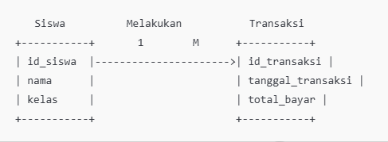

### 1. **Relasi 1-N (Satu ke Banyak)**

#### Relasi 1-N dalam Studi Kasus

Relasi 1-N di diagram ini terjadi antara entitas `Siswa` dan `Transaksi`, di mana **satu siswa dapat melakukan banyak transaksi**. Namun, setiap transaksi hanya terkait dengan satu siswa.

#### ERD untuk Relasi 1-N (Siswa dan Transaksi)

#### Deskripsi Relasi
Dalam relasi 1-N ini:
- **Setiap siswa** dapat memiliki **banyak transaksi**. Misalnya, siswa dengan `id_siswa = 1` (Ali) memiliki dua transaksi (`id_transaksi = 101` dan `id_transaksi = 102`).
- **Setiap transaksi** hanya dilakukan oleh **satu siswa**. Artinya, kolom `id_siswa` pada tabel `Transaksi` menunjuk pada siswa yang melakukan transaksi tersebut.
#### Deskripsi Relasi
Dalam relasi N-N ini:
- **Satu transaksi** dapat memiliki **banyak produk**. Misalnya, transaksi dengan `id_transaksi = 101` memiliki dua produk (`id_produk = 201` dan `id_produk = 202`).
- **Satu produk** dapat **dibeli di banyak transaksi**. Misalnya, produk dengan `id_produk = 201` muncul dalam dua transaksi (`id_transaksi = 101` dan `id_transaksi = 102`).
- Tabel `Detail_Transaksi` berfungsi sebagai penghubung antara `Transaksi` dan `Produk`, menyimpan informasi tambahan seperti jumlah produk yang dibeli (`jumlah`) dan total harga (`total_harga`) untuk setiap item dalam transaksi.
### 2. **Relasi N-N (Banyak ke Banyak)**

#### Relasi N-N dalam Studi Kasus

Relasi N-N terjadi antara entitas `Detail_Transaksi` dan `Produk`, di mana **satu transaksi dapat mencakup banyak produk**, dan **satu produk dapat dibeli dalam banyak transaksi**. Untuk merepresentasikan relasi N-N, dibutuhkan tabel penghubung (associative table) yang disebut `Detail_Transaksi`.

#### Deskripsi Relasi

Dalam relasi N-N ini:

- **Satu transaksi** dapat memiliki **banyak produk**. Misalnya, transaksi dengan `id_transaksi = 101` memiliki dua produk (`id_produk = 201` dan `id_produk = 202`).
- **Satu produk** dapat **dibeli di banyak transaksi**. Misalnya, produk dengan `id_produk = 201` muncul dalam dua transaksi (`id_transaksi = 101` dan `id_transaksi = 102`).
- Tabel `Detail_Transaksi` berfungsi sebagai penghubung antara `Transaksi` dan `Produk`, menyimpan informasi tambahan seperti jumlah produk yang dibeli (`jumlah`) dan total harga (`total_harga`) untuk setiap item dalam transaksi.