## praktikum 7

# 1

*QUERY SQL* 
SQL
```sql
SELECT orders.OrderID, orders.OrderDate, orders.CustomerID, customers.CompanyName, customers.ContactName, customers.City, customers.Phone
FROM orders, customers
WHERE orders.CustomerID = customers.customerID;
```

*PENJELASANNYA:*
SELECT
- Untuk memilih kolom mana saja yang ingin ditampilkan dari tabel mana kolom tersebut diambil.
 orders.OrderID
- `orders` merupakan nama tabel yang ingin ditampilkan kolomnya, yaitu `OrderID`. Jadi, kolom `OrderID` pada tabel `orders` ingin ditampilkan.
 orders.OrderDate
- Kolom `OrderDate` pada tabel `orders` ingin ditampilkan.
 orders.CustID
- Kolom `CustID` dalam tabel `orders` dipilih untuk ditampilkan.
 customers.CompanyName
- Kolom `CompanyName` dalam tabel `customers` dipilih untuk ditampilkan.
 customers.ContactName
- Kolom `ContactName` dalam tabel `customers` dipilih untuk ditampilkan.
 customers.City
- Kolom `City` dalam tabel `customers` dipilih untuk ditampilkan.
 customers.Phone
- Kolom `Phone` dalam tabel `customers` dipilih untuk ditampilkan.
 FROM orders, customers
- Untuk memilih dari tabel mana saja yang kolomnya ingin dipilih untuk ditampilkan. `orders` adalah nama tabel pertama yang dipilih, dan `customers` adalah nama tabel kedua yang dipilih.
 WHERE
- Kondisi yang harus dipenuhi oleh suatu kolom data agar bisa ditampilkan.
 (orders.CustID = customers.CustomerID)
- Kondisi dari `WHERE` yang harus dipenuhi: data pada kolom `CustID` dalam tabel `orders` harus sama dengan data pada kolom `CustomerID` dalam tabel `customers` agar masing-masing dapat ditampilkan.
 Hasilnya
- Jadi yang tampil adalah kolom `OrderID`, `OrderDate`, dan `CustID` dari tabel `orders`, serta kolom `CompanyName`, `ContactName`, `City`, dan `Phone` dari tabel `customers`.
*HASILNYA:*
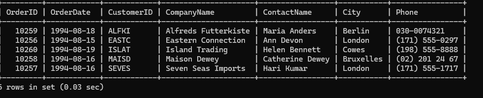

# 2

*Query Sql:*
SQL
```sql
SELECT o.OrderID, o.OrderDate, o.CustomerID,
       c.CompanyName, c.ContactName, c.City, c.Phone
FROM orders o
JOIN customers c ON o.CustomerID = c.CustomerID
WHERE c.City = 'London';
```

*Penjelasan:*
 - SELECT
= untuk memilih kolom mana saja yang ingin ditampilkan dan dari tabel mana kolom tersebut diambil.
 - orders.OrderID
= `orders` merupakan nama tabel yang ingin ditampilkan kolomnya yaitu `OrderID`. Jadi kolom `OrderID` pada tabel -  - orders ingin ditampilkan.
- orders.OrderDate
= kolom `OrderDate` pada tabel `orders` ingin ditampilkan.
 - orders.CustID
= kolom `CustID` dalam tabel `orders` dipilih untuk ditampilkan.
- customers.CompanyName
= kolom `CompanyName` dalam tabel `customers` dipilih untuk ditampilkan.
- customers.ContactName
= kolom `ContactName` dalam tabel `customers` dipilih untuk ditampilkan.
 - customers.City
= kolom `City` dalam tabel `customers` dipilih untuk ditampilkan.
- customers.Phone
= kolom `Phone` dalam tabel `customers` dipilih untuk ditampilkan.
 - FROM orders, customers
= untuk memilih dari tabel mana saja yang kolomnya ingin dipilih untuk ditampilkan. `orders` adalah nama tabel pertama yang dipilih dan `customers` adalah nama tabel kedua yang dipilih.
- WHERE
= kondisi yang harus dipenuhi oleh suatu kolom data agar bisa ditampilkan.
- (orders.CustID = customers.CustomerID)
= kondisi dari `WHERE` yang harus dipenuhi: data pada kolom `CustID` dalam tabel `orders` harus sama dengan data pada kolom `CustomerID` dalam tabel `customers` agar masing-masing dapat ditampilkan.
Hasilnya
= Jadi yang tampil adalah kolom `OrderID`, `OrderDate`, dan `CustID` dari tabel `orders` serta kolom `CompanyName`, `ContactName`, `City`, dan `Phone` dari tabel `customers`. Jadi, hanya barisan data di mana kolom `City` dari tabel `customers` memenuhi nilai `"London"` yang akan ditampilkan.

*Hasilnya:*
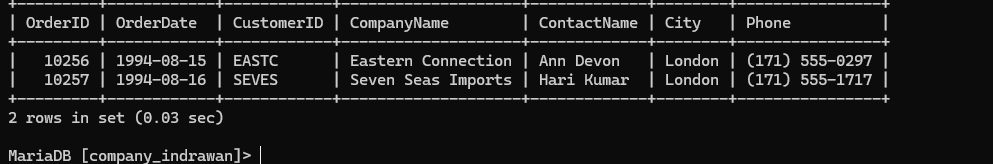

# 3
*Query Sql:*
SQL
```sql
SELECT o.OrderID, o.OrderDate, c.CompanyName,
c.ContactName, c.Phone, e.LastName, e.Title 
FROM orders o, customers c, employees e 
WHERE o.CustomerID = c.CustomerID AND o.EmpID = e.EmpID;
```
*Penjelasan:*
- SELECT
= untuk memilih kolom mana saja yang ingin ditampilkan dan dari tabel mana kolom tersebut diambil.
- o.OrderID, o.OrderDate
= kolom `OrderID` dan `OrderDate` dari tabel `o` (orders) dipilih untuk ditampilkan.
- c.CompanyName, c.ContactName, c.Phone*
= kolom-kolom `CompanyName`, `ContactName`, dan `Phone` dari tabel `c` (customers) dipilih untuk ditampilkan.
e.LastName, e.Title
= kolom `LastName` dan `Title` dari tabel `e` (employees) dipilih untuk ditampilkan.
- FROM orders o, customers c, employees e
= untuk memilih dari tabel mana saja yang kolomnya ingin dipilih untuk ditampilkan. `orders` disingkat jadi `o` adalah nama tabel yang dipilih. `customers` disingkat jadi `c` adalah nama tabel yang dipilih. `employees` disingkat jadi `e` adalah nama tabel yang dipilih untuk ditampilkan.
- WHERE
= kondisi yang harus dipenuhi oleh suatu data agar bisa ditampilkan.
- o.CustID = c.CustomerID 
= data pada kolom `CustID` dalam tabel `o` (orders) harus sama dengan data pada kolom `CustomerID` dalam tabel `c` (customers).
-AND
= untuk menyeleksi dua data atau lebih pada perintah `WHERE`.
- (o.EmpID = e.EmpID)
= data pada kolom `EmpID` dalam tabel `o` (orders) harus sama dengan data pada kolom `EmpID` dalam tabel `e` (employees).
**Hasilnya**  
= yang tampil adalah kolom yang memenuhi semua kondisi dari `WHERE`.
*Hasilnya:*
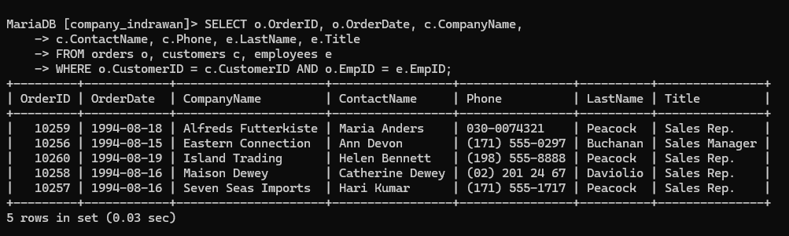

# 4
*Query Sql:*
SQL
```sql
 SELECT o.OrderID, o.OrderDate, c.CompanyName,
     c.ContactName, c.Phone, e.LastName, e.Title
     FROM orders o, customers c, employees e
     WHERE o.CustomerID = c.CustomerID AND o.EmpID = e.EmpID AND e.EmpID AND
     e.FirstName = 'Margaret';
```

*Penjelasan:*
- SELECT
- untuk memilih kolom mana saja yang ingin ditampilkan dan dari tabel mana kolom tersebut diambil.
- o. OrderID, o.OrderDate
- kolom `OrderID` dan `OrderDate` dari tabel `o` (orders) dipilih untuk ditampilkan.
- c.CompanyName, c.ContactName, c.Phone
- kolom `CompanyName`, `ContactName`, dan `Phone` dari tabel `c` (customers) dipilih untuk ditampilkan.
- e.LastName, e.Title
- kolom `LastName` dan `Title` dari tabel `e` (employees) dipilih untuk ditampilkan.
- FROM orders o, customers c, employees e
- untuk memilih dari tabel mana saja yang kolomnya dipilih untuk ditampilkan.
- `Orders` atau `o` adalah nama tabel yang dipilih.
- `Customers` atau `c` adalah nama tabel yang dipilih.
- `Employees` atau `e` adalah nama tabel yang dipilih untuk ditampilkan.
-  WHERE
- kondisi yang harus dipenuhi oleh suatu kolom data agar bisa ditampilkan.
- (o.CustID = c.CustomerID)
- data pada kolom `CustID` dalam tabel `o` (orders) harus sama dengan data pada kolom `CustomerID` dalam tabel `c` (customers).
- AND
- untuk menyeleksi dua data atau lebih pada perintah `WHERE`.
- (o.EmpId = e.EmpID)
- data pada kolom `EmpId` dalam tabel `o` (orders) harus sama dengan data pada kolom `EmpID` dalam tabel `e` (employees)..
- (e.FirstName = "Margaret")
= data pada kolom `FirstName` dalam tabel `e` (employees) harus berisi data "Margaret" agar bisa tampil.
**Hasilnya**  
= Jadi, barisan data yang sudah memenuhi kondisi `WHERE` akan tampil, terutama kolom `FirstName` dari tabel `employees` yang isinya "Margaret".
*Hasilnya:*
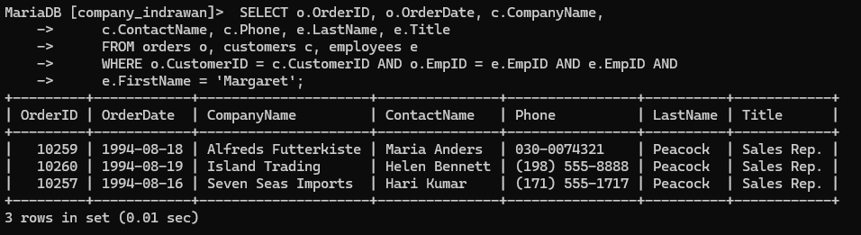

# 5
*Query Sql:*
SQL
```sql
SELECT c.CustomerID, c.CompanyName, o.OrderID,
     o.OrderDate, od.ProductID, p.ProductName,
      od.Quantity AS Qty, od.UnitPrice
     FROM customers c, orders o, orderdetails od, products p
     WHERE c.CustomerID = o.CustomerID AND o.OrderID = od.OrderID
     AND p.ProductID = od.ProductID
     ORDER BY c.CustomerID;
```

*Penjelasan:*
- SELECT = untuk memilih kolom mana saja yang ingin ditampilkan dari dari tabel mana kolom tersebut diambil.
- C.CustomerID, C.CompanyName = kolom CustomerID dan CompanyName dari tabel C (customers) dipilih untuk ditampilkan.
- O.OrderID, O.OrderDate = kolom OrderID dan OrderDate dari tabel O (orders) dipilih untuk ditampilkan.
- od.ProductID, od.Quantity, od.UnitPrice = kolom ProductID, Quantity dan UnitPrice dari tabel od (orderdetails) dipilih untuk ditampilkan.
- P.ProductName = kolom ProductName merupakan kolom dari tabel P (Products) yang dipilih untuk ditampilkan.
- od.Quantity AS Qty = kolom Quantity ditampilkan sebagai nama sementaranya yaitu Qty. AS untuk mengubah nama suatu kolom secara sementara.
- FROM customers C, orders O, orderdetails od, products P = untuk memilih dari tabel mana saja yang kolomnya dipilih untuk ditampilkan. Customers atau C adalah nama tabel yang dipilih untuk ditampilkan. Orders atau O adalah nama tabel yang dipilih untuk ditampilkan. Orderdetails atau od adalah nama tabel yang dipilih untuk ditampilkan. Products atau P adalah nama tabel yang dipilih untuk ditampilkan.
- WHERE = kondisi yang harus dipenuhi oleh suatu kolom data agar bisa ditampilkan.
- (C.CustomerID = O.CustID) = data pada kolom CustomerID dari tabel customers atau C harus sama dengan data pada kolom CustID dari tabel orders atau O.
- AND = untuk menyeleksi dua data atau lebih pada perintah WHERE.
- (O.OrderID = od.OrderID) = data pada kolom OrderID dari tabel orders atau O harus sama dengan data pada kolom OrderID dari tabel orderdetails atau od.
- AND = untuk menyeleksi dua data atau lebih pada perintah WHERE.
**(P.ProductID = od.ProductID) = data pada kolom ProductID dari tabel Products atau P harus sama dengan data pada kolom ProductID dari tabel orderdetails atau od.**

- ORDER BY C.CustomerID = untuk menurut data berdasarkan kolom CustomerID dari tabel customers.

**Hasilnya = kolom-kolom data yang tampil adalah data yang telah memenuhi kondisi-kondisi yang ada, dan seluruh isi data tersebut diurut berdasarkan satu kolom yaitu CustomerID dari tabel customers.**
*Hasilnya:*
	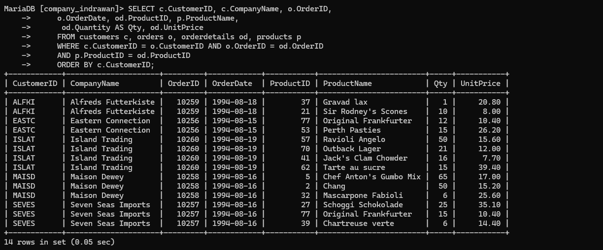

# 6
*Query Sql:*
SQL
```sql
SELECT c.CustomerID, c.CompanyName, CONCAT(e.LastName, ', ', e.FirstName) AS EmployeeName, od.productid as prodID,
 p.ProductName, od.quantity AS Qty FROM customers c, orders o, orderdetails od,products p, employees e
WHERE c.customerid=o.CustomerID and o.orderid =od.orderid and p.productid=od.productid and e.empid=o.empid order by o.orderID;
```

*Penjelasan:*
**Penjelasan:**
- SELECT*= untuk memilih kolom mana saja yang ingin ditampilkan dan darimana serta dari tabel mana kolom tersebut dipilih.
- C.CustomerID, C.CompanyName= kolom CustomerID dan CompanyName dari tabel C(Customers) dipilih untuk ditampilkan.
- O.OrderID AS OrdID, O.OrderDate*= kolom OrderID dan OrderDate dari tabel O(Orders) dipilih untuk ditampilkan. AS merupakan perintah untuk mengubah nama suatu kolom secara sementara. Dalam hal ini kolom OrderID diubah namanya sementara menjadi OrdID.
- CONCAT(E.LastName, ' ', E.FirstName) AS EmployeeName = CONCAT adalah perintah untuk menggabungkan beberapa kolom data menjadi satu kolom data. (E.LastName, ' ', E.FirstName) merupakan kolom-kolom yang ingin digabung. LastName dan FirstName merupakan kolom dari tabel E(Employees) yang ingin digabung. (' ', ' ') merupakan separator atau pemisah dari kedua kolom yang ingin digabungkan.
- AS EmployeeName*untuk mengubah hasil concat tadi menjadi EmployeeName (namanya) untuk sementara.
- od.ProductID AS ProdID, od.Quantity AS Qty = kolom ProductID dan Quantity dari tabel od(orderdetails) dipilih untuk ditampilkan. Kolom ProductID.
- P.ProductName*= kolom ProductName dari tabel P(Products) dipilih untuk ditampilkan.
- FROM customers C, orders O, orderdetails od, products P, employees E= untuk memilih dari tabel mana saja yang kolomnya dipilih untuk ditampilkan. Customers atau C adalah nama tabel yang dipilih. Orders atau O adalah nama tabel yang dipilih. Orderdetails od adalah nama tabel yang dipilih. Products atau P adalah nama tabel yang dipilih. Employees atau E adalah nama tabel yang dipilih.
- WHERE= kondisi yang harus dipenuhi oleh suatu kolom data agar bisa ditampilkan.
- (C.CustomerID = O.CustID) = data pada kolom CustomerID dari tabel C(customers) harus sama dengan data pada kolom CustID dari tabel O(orders).
- AND= untuk menyeleksi dua data atau lebih pada perintah WHERE.
- (O.OrderID = od.OrderID)= data pada kolom OrderID dari tabel O(orders) harus sama dengan data pada kolom OrderID dari tabel od(orderdetails).
- AND = untuk menyeleksi dua data atau lebih pada perintah WHERE.
- (P.ProductID = od.ProductID) = data pada kolom ProductID dari tabel P(ProductID) harus sama dengan data pada kolom ProductID dari tabel od(orderdetails)
- AND= untuk menyeleksi dua data atau lebih pada perintah WHERE.
- (E.EmpID = O.EmpID)= data pada kolom EmpID dari tabel E(employees) harus sama dengan data pada kolom EmpID dari tabel O(orders).
- ORDER BY O.OrderID = untuk menurut data berdasarkan kolom OrderID dari tabel orders.
- Hasilnya = kolom LastName dan FirstName dari tabel E(employees) digabung dengan concat dan hasil kolomnya namanya diubah sementara jadi EmployeeName.

*Hasilnya:*
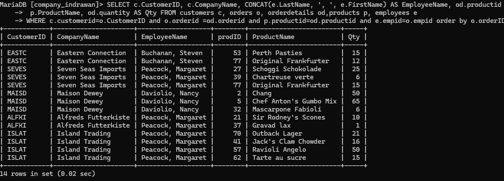


# 7. **Creating a View (CustOrderEmp):
*Query Sql:*
SQL
```sql
SELECT c.CustomerID, c.CompanyName, CONCAT(e.LastName, ', ', e.FirstName) AS EmployeeName, od.productid as prodID,
 p.ProductName, od.quantity AS Qty FROM customers c, orders o, orderdetails od,products p, employees e
WHERE c.customerid=o.CustomerID and o.orderid =od.orderid and p.productid=od.productid and e.empid=o.empid order by o.orderID;

```
*Penjelasan:*
- CREATE VIEW custorderEmp = merupakan tabel virtual yang dibuat dengan nama **custorderEmp**.
- AS SELECT= untuk memilih kolom-kolom mana saja yang ingin dipilih untuk dimasukkan ke tabel virtual.
- C.CustomerID, C.CompanyName, C.contactname = kolom customerID, companyName, dan contactname dari tabel **c(customers)** dipilih untuk dimasukkan ke dalam tabel virtual.
- O.orderID, o.orderdate= kolom orderID dan orderDate dari tabel **o(orders)** dipilih untuk dimasukkan ke dalam tabel virtual.
- e.EmpID, e.Lastname, e.Firstname = kolom EmpID, lastname, dan firstname dari tabel **e(Employees)** dipilih untuk dimasukkan ke dalam tabel virtual.
- FROM customers c, orders o, employees e = untuk memilih dari tabel mana saja yang kolomnya dipilih untuk tabel virtual. **customers**, **orders**, dan **employees** merupakan nama tabel yang kolomnya dipilih.
- WHERE= kondisi yang harus dipenuhi oleh suatu data agar bisa dimasukkan ke dalam tabel virtual.
- **(C.CustomerID = o.custID)** = data pada kolom CustomerID dari tabel **c(customers)** harus sama dengan data pada kolom custID dari tabel **o(orders)** agar bisa dimasukkan.
- AND = untuk menyeleksi dua data atau lebih pada **WHERE**.
- (o.EmpID = e.EmpID)= data pada kolom EmpID dari tabel **o(orders)** harus sama dengan data pada kolom EmpID dari tabel **e(Employees)** agar bisa dimasukkan.
- Hasilnya= sebuah tabel virtual telah dibuat dengan nama **custorderEmp** yang berisi kolom-kolom dari 3 tabel **customers**, **orders**, **employees** dan telah memenuhi semua kondisi.
*Hasilnya:*
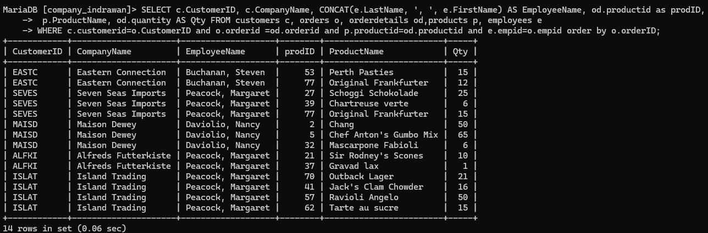


# 8
### SQL untuk Membuat View odproductsc:

sql
```sql
CREATE VIEW odproductsc
    AS
    SELECT od.OrderID, od.ProductID, p.ProductName,
    od.Quantity, od.UnitPrice
    FROM orderdetails od, products p
    WHERE p.ProductID = od.ProductID;
```

*Penjelasan:*
- CREATE VIEW odProducts = untuk membuat tabel virtual dengan nama **odProducts**.
- AS SELECT = untuk memilih kolom-kolom mana saja yang ingin dipilih untuk dimasukkan ke tabel virtual.
- od.orderID, od.ProductID, od.unitPrice, od.quantity= kolom orderID, ProductID, unitPrice dan quantity dari tabel od(orderdetails) dipilih untuk dimasukkan.
- P.ProductName = kolom ProductName dari tabel **P(products)** dipilih untuk dimasukkan.
- FROM orderdetails od, products P = untuk memilih dari tabel mana saja yang kolomnya dipilih untuk dimasukkan. orderdetails dan **products** adalah nama tabel yang dipilih.
- WHERE = kondisi yang harus dipenuhi oleh suatu data agar bisa dimasukkan ke dalam tabel virtual.
- (P.ProductID = od.ProductID) = data pada kolom ProductID dari tabel **P(products)** harus sama dengan kolom productID dari tabel od(orderdetails) agar bisa dimasukkan.
- Hasilnya= Tabel virtual yang bernama **odProducts** yang terdiri dari kolom-kolom yang diambil dari 2 tabel **orderdetails** dan **products**
*HASILNYA:*
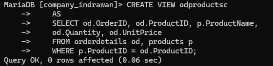
*hasilnya:*
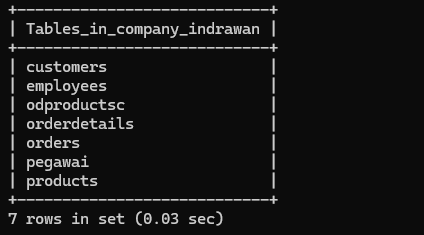
### SQL untuk Menampilkan Data dari View odproductsc:

sql
`SELECT * FROM odproductsc;`

Query ini digunakan untuk memilih semua data dari view odproductsc, yang menampilkan kolom-kolom:
- OrderID: ID dari pesanan.
- ProductID: ID dari produk yang dipesan.
- ProductName: Nama produk yang dipesan.
- Quantity: Jumlah produk yang dipesan.
- UnitPrice: Harga per unit dari produk tersebut.
*hasilnya:*
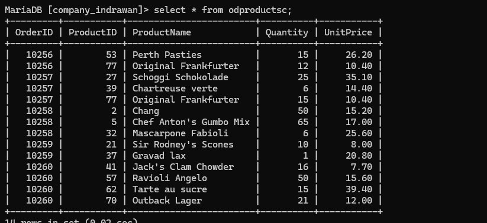

# 9
*QUERY SQL:*
sql
```sql
SELECT c.CustomerID, c.CompanyName, o.OrderID, od.ProductID,
ROUND(od.unitprice, 2), od.quantity, od.discount,
 ROUND(((1-od.discount) * od.unitprice * od.quantity), 2) AS Jumlah
FROM customers c, orders o, orderdetails od WHERE c.CustomerID=o.CustomerID AND o.OrderID=od.OrderID
ORDER BY c.CustomerID;

```
*Penjelasan:*
- SELECT = untuk memilih kolom mana saja yang ingin ditampilkan dan dihitung.
- c.customerID, C.companyName= kolom customerID dan companyName dari tabel c(customers) dipilih untuk ditampilkan.
- o.orderID = kolom orderID dari tabel **o(orders)** dipilih untuk ditampilkan.
- od.ProductID, od.unitPrice, od.quantity, od.Discount= kolom ProductID, unitPrice, quantity dan discount dari tabel od(orderdetails)dipilih untuk ditampilkan dan dihitung.
- ROUND(od.unitPrice, 2)= untuk membuat bilangan dari kolom unitPrice sampai jumlah digit tertentu, sesuai dengan pilihan yang dibuat yaitu 2.
- ROUND((1 - od.Discount) * od.unitPrice * od.quantity), 2) AS Jumlah = untuk membulatkan bilangan dari kolom hasil dari (1 dikurang kolom discount lalu dikali unitPrice dan kali quantity) sampai jumlah digit yaitu 2.
- AS Jumlah untuk menambah kolom hasil tersebut dengan nama sementara yaitu Jumlah.
- FROM customers c, orders o, orderdetails od = untuk memilih dari tabel mana saja yang kolomnya dipilih untuk ditampilkan, di sini dari tabel **customers**, **orders**, **orderdetails** merupakan nama-nama tabel yang dipilih.
- WHERE = kondisi yang harus dipenuhi oleh suatu data agar bisa ditampilkan.
- (c.customerID = o.custID) = data pada kolom customerID dari tabel **c(customers)** harus sama dengan data pada kolom custID dari tabel **o(orders)**.
- AND = untuk menyeleksi dua data atau lebih pada kondisi **WHERE**.
- (o.orderID = od.orderID) = data pada kolom orderID dari tabel **o(orders)** harus sama dengan data pada kolom orderID dari tabel od(orderdetails)
- ORDER BY c.customerID = untuk mengurut data berdasarkan kolom customerID dari tabel **c(customers)**.
- Hasil = akan tampil hasil pembulatan dari kolom-kolom yang telah memenuhi kondisi dari **WHERE**.
*HASILNYA:*
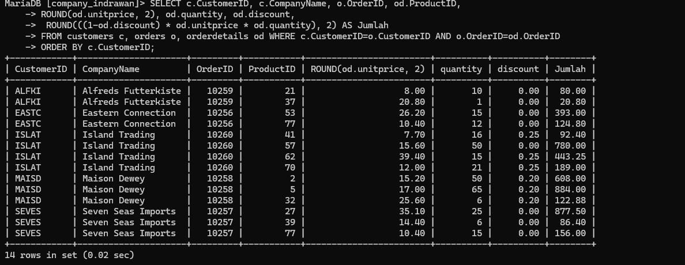

# 10
*QUERY SQL:*
sql
```sql
 SELECT c.customerid, c.companyname, ROUND(SUM((1-od.discount)*od.unitprice*od.quantity),2) AS TotalJumlah
     FROM customers c, orders o, orderdetails od WHERE c.customerid=o.customerid AND o.orderid=od.orderid
     GROUP BY c.customerid, c.companyname
     ORDER BY c.customerid;

```

*Penjelasan:*
- SELECT= untuk memilih kolom mana saja yang ingin ditampilkan dan dibulatkan.
- c.customerID, c.companyName = kolom customerID dan companyName dari tabel c(customers)*dipilih untuk ditampilkan.
- ROUND(SUM((1 - od.discount)  od.unitPrice * od.quantity), 2) AS totalJumlah** = untuk membulatkan hasil sum dari (1 dikurang kolom Discount dikali unitPrice kali quantity) sampai 2 digit.
- Dan nama kolom hasilnya diubah sementara jadi totalJumlah.
- FROM customers c, orders o, orderdetails od = untuk memilih dari tabel mana saja yang kolomnya dipilih untuk ditampilkan dan dibulatkan. **customers**, **orders**, dan **orderdetails** adalah nama tabel yang dipilih.
- where = kondisi yang harus dipenuhi oleh suatu data agar bisa ditampilkan,
- (c.customerID=o.custID) = data pada kolom customerID dari tabel c(customers) harus sama dengan data pada kolom custID dari tabel o(orders)
-  AND = untuk menyeleksi dua data atau lebih pada kondisi WHERE
- (o.orderID=od.orderID)=data pada kolom orderID dari tabel od(orderdetails)
- GROUP BY c.customerID,c.companyName = untuk mengelompokkan data sesuai dengan kolom customerID dan companyName dari tabel c(customers)
- ORDER BY c.customerID = untuk mengurut data berdasarkan kolom customerID dari tabel c(customers)
- hasilnya = jadi, kolom yang dikelompokkan adalah customerID dan companyName dan tabel diurutkan berdasarkan kolom customerID
*HASILNYA:*
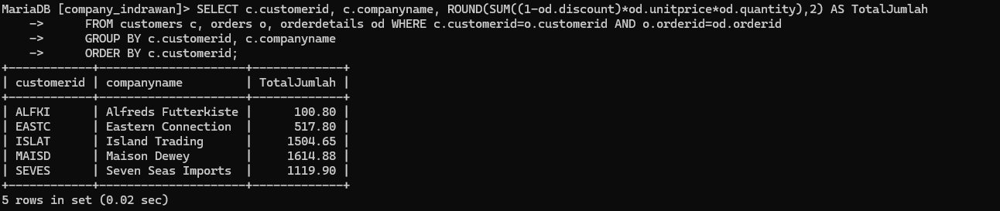


# TABEL KESELURUHAN PRAKTIK 
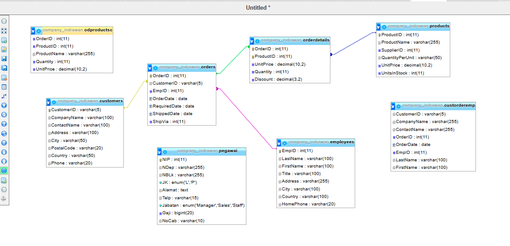